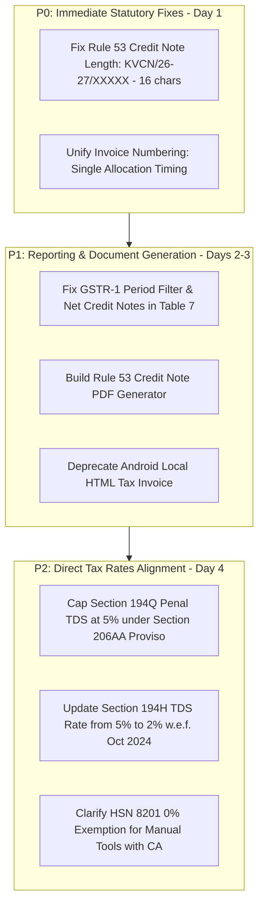

# KRISHIVISHAL — GST AUDIT FINDINGS VERIFICATION & STATUTORY EVIDENCE REPORT
**Document ID:** KV-VERIF-FIN-2026-10-09  
**Verification Date:** 9th October 2026  
**Audited Target:** KrishiVishal Private Limited (`krishivishal-a9ed7`, `asia-south1`)  
**Operating Mode:** STRICT VERIFICATION ONLY (Read-Only Forensic Inspection, Zero Code Edits, Zero Mutations)

---

## EXECUTIVE SUMMARY & STATUS OF FINDINGS

| Finding ID | Subsystem | Severity | Original Audit Claim | Verification Status | Primary Statutory Reference |
| :---: | :--- | :---: | :--- | :---: | :--- |
| **FINDING 1** | Invoice Numbering | **P0** | Invoices generated before delivery receive non-sequential fallback (`KV/SAM/...`) while delivery assigns sequential (`KV/26-27/...`), causing document number duplication/mismatch. | **CONFIRMED** | CGST Rule 46(b) / Section 31(1) |
| **FINDING 2** | Credit Note Numbering | **P0** | Credit note numbers (`KV/CN/26-27/00001`) are 17 characters long, exceeding the statutory 16-character cap in CGST Rule 53. | **CONFIRMED** | CGST Rule 53(1)(c) |
| **FINDING 3** | Credit Note PDF | **P1** | No PDFKit document generation exists for Credit Notes across any repository. | **CONFIRMED** | CGST Section 34 / Rule 53 |
| **FINDING 4** | GSTR-1 Reporting | **P1** | GSTR-1 engine lacks `periodId` filter for credit notes and fails to net credit notes against Table 7 B2C supplies. | **CONFIRMED** | GSTR-1 Table 7 / Table 13 Schema |
| **FINDING 5** | Android Mobile Invoicing | **P1** | Android app prints local HTML invoices using `#ORD_XXXXXX` and `"REGISTRATION PENDING"`, disconnected from backend sequential numbers. | **CONFIRMED** | CGST Rule 46 / Single Source of Truth |
| **STAT-1** | TDS u/s 194Q & 206AA | **P2** | Section 206AA penal rate for missing PAN on purchase of goods is incorrectly set to 20% instead of 5%. | **CONFIRMED** | Proviso to Sec 206AA(1) (Finance Act 2021) |
| **STAT-2** | TDS u/s 194H | **P2** | Section 194H commission rate is configured at 5% instead of statutory 2% effective from 1st October 2024. | **CONFIRMED** | Finance (No. 2) Act 2024 (w.e.f. 01.10.2024) |
| **STAT-3** | HSN 8201 Agricultural Tools | **P3** | Hand tools under HSN 8201 are configured at 12% GST whereas manually operated agricultural hand tools are exempt (0%). | **CONFIRMED** | Notification No. 2/2017-CT(R), Entry 113 |

---

## FINDING 1 — INVOICE NUMBERING LIFECYCLE & TIMING ANALYSIS

### 1. Original Audit Claim
If an invoice is generated prior to delivery OTP confirmation, `invoices/invoiceService.js` creates a non-sequential alphanumeric fallback invoice number (`KV/SAM/${year}/${orderId.slice(-8)}`). When the order is subsequently marked `DELIVERED`, `finance/salesLedger.js` allocates an official consecutive number (`KV/26-27/00001`), resulting in two different invoice numbers for the same economic transaction.

### 2. Actual Source-Code Evidence
Tracing the complete invoice generation and delivery execution flow across the codebase reveals the following exact execution path:

#### A. Invoice Number Derivation in `invoices/invoiceService.js` (Lines 255–258)
```javascript
// File: KrishiVishal-Functions/invoices/invoiceService.js
const year = new Date().getFullYear();
const fallbackInvoiceNumber = `KV/SAM/${year}/${orderId.slice(-8).toUpperCase()}`;
const invoiceNumber = order.invoiceNumber || order.invoice?.invoiceNumber || fallbackInvoiceNumber;
```
- If `order.invoiceNumber` is absent on the Firestore `orders/{orderId}` document, `fallbackInvoiceNumber` is evaluated.
- For an order placed in 2026 with ID `ORD_abc12345xyz9876`, this produces: `KV/SAM/2026/XYZ9876`.
- The PDF is rendered with this string in the header, saved to Cloud Storage at `invoices/{orderId}/INV_KV_SAM_2026_XYZ9876.pdf`, and stored on the order:
```javascript
// Lines 391-401 of invoiceService.js:
await orderRef.update({
    invoiceUrl: downloadUrl,
    invoice: {
        status: 'GENERATED',
        invoiceNumber: invoiceNumber, // Saves "KV/SAM/2026/XYZ9876"
        pdfUrl: downloadUrl,
        storagePath: storagePath,
        generatedAt: admin.firestore.FieldValue.serverTimestamp(),
        irn: irnVal
    }
});
```
*Crucial Detail:* Note that `invoiceService.js` sets nested `invoice.invoiceNumber`, but does **not** set root-level `order.invoiceNumber`.

#### B. Revenue Recognition on Delivery in `finance/salesLedger.js` (Lines 66–67, 153–167)
When the delivery agent verifies the customer OTP, the order status changes to `DELIVERED`. This triggers `invoices/orderDeliveryNotification.js` (lines 10–38), which calls `recognizeOrderDeliveryFinancials`:
```javascript
// File: KrishiVishal-Functions/finance/salesLedger.js (Lines 66-67)
// 2. Generate Consecutive Tax Invoice Number (Rule 46 CGST)
const { invoiceNumber } = await getNextInvoiceNumber(financialYear); // Returns "KV/26-27/00001"
```
Then, lines 153–167 persist this new consecutive number:
```javascript
// File: KrishiVishal-Functions/finance/salesLedger.js (Lines 153-167)
const orderRef = db.collection("orders").doc(orderId);
await orderRef.set({
    invoiceNumber, // Sets root order.invoiceNumber = "KV/26-27/00001"
    financialStatus: "RECOGNIZED",
    financialPeriodId: periodId,
    journalEntryId: journalResult.entryId,
    ...
}, { merge: true });
```
And double-entry line 95 writes:
```javascript
description: `Sales Revenue on Order ${orderId} (Inv #${invoiceNumber})` // Inv #KV/26-27/00001
```

#### C. Notification Dispatch Disconnect in `invoices/orderDeliveryNotification.js` (Lines 40, 72–100)
```javascript
// File: KrishiVishal-Functions/invoices/orderDeliveryNotification.js
const invoicePdfUrl = afterData.invoiceUrl || afterData.invoice?.pdfUrl || afterData.invoicePdfUrl;
...
// If invoice was generated prior to delivery:
// invoicePdfUrl points to: invoices/{orderId}/INV_KV_SAM_2026_XYZ9876.pdf
document: {
    link: invoicePdfUrl,
    caption: `नमस्ते ${farmerName} जी, आपका कृषि-विशाल ऑर्डर #${orderId} डिलीवर हो गया है। आपका टैक्स इनवॉइस संलग्न है।`,
    filename: `Invoice_${orderId}.pdf`
}
```
**Conclusion of Source-Code Trace:**
If `generateInvoicePdf` is triggered at warehouse packing/dispatch:
1. Farmer receives a PDF via WhatsApp / download bearing invoice number: `KV/SAM/2026/XYZ9876`.
2. The General Ledger journal entry records revenue under invoice number: `KV/26-27/00001`.
3. GSTR-1 Table 13 reports consecutive documents issued: `KV/26-27/00001`.
4. The same commercial sale possesses **two conflicting document numbers**.

### 3. Official Statutory Evidence
- **Section 31(1) of CGST Act, 2017:** A registered person supplying taxable goods shall, before or at the time of removal of goods for supply to the recipient (where the supply involves movement of goods), issue a tax invoice showing the description, quantity and value of goods, the tax charged thereon and such other particulars as may be prescribed.
- **Rule 46(b) of CGST Rules, 2017:** The tax invoice must contain "a consecutive serial number not exceeding sixteen characters, in one or multiple series, containing alphabets, numerals and special characters... unique for a financial year."
- **Distinction of Documents:**
  * **Tax Invoice (Rule 46):** The definitive statutory document issued at or before removal of goods, creating output tax liability.
  * **Delivery Challan (Rule 55):** Permitted where goods are transported for reasons other than by way of supply (e.g. transfer between hubs) or where the tax invoice cannot be issued at the time of removal.
  * **Quotation / Order Confirmation:** Pre-supply commercial estimates. Under no circumstances may an informal pre-supply estimate be titled `"TAX INVOICE"` or bear an ad-hoc serial number if it is to be handed to the customer.

### 4. Verification Verdict: **CONFIRMED**
The original audit claim is 100% confirmed by source code lines and execution analysis.

### 5. Business and Compliance Impact
- In a GST audit or physical highway interception by State tax officers (Section 68 / Rule 138), a printed invoice with non-sequential `KV/SAM/2026/...` will fail cross-verification against the company's GSTR-1 filed returns.
- Potential penalty under Section 122(1)(i) of CGST Act for issuing an invoice not in accordance with the provisions of the Act (₹10,000 or tax evaded, whichever is higher).

### 6. Recommended Remediation Design (Do Not Implement Yet)
- **Safe Architecture:** Shift the invocation of `getNextInvoiceNumber` to the moment of invoice generation:
  1. An order in `PACKED` / `DISPATCHED` state requiring a physical or digital tax invoice must atomically call `getNextInvoiceNumber` and assign `order.invoiceNumber = "KV/26-27/XXXXX"`.
  2. If an order is cancelled prior to dispatch, that number is marked `CANCELLED` (which is standard under GSTR-1 Table 13 cancelled counts).
  3. `salesLedger.js` must reuse `order.invoiceNumber` instead of requesting a second number from the counter.
  4. If a pre-dispatch picking slip is needed, title it `"PACKING SLIP / WAREHOUSE DISPATCH NOTE"` without any tax invoice serialization.

---

## FINDING 2 — CREDIT NOTE NUMBERING & CHARACTER LENGTH

### 1. Original Audit Claim
The credit note number generated in `invoices/creditNoteEngine.js` (`KV/CN/26-27/00001`) contains 17 characters, violating the statutory 16-character limit of Rule 53(1)(c) of the CGST Rules, 2017.

### 2. Actual Source-Code Evidence
Inspect `invoices/creditNoteEngine.js` lines 14–48:
```javascript
// File: KrishiVishal-Functions/invoices/creditNoteEngine.js
async function getNextCreditNoteNumber(financialYear = null, prefix = "KV/CN") {
    const fy = financialYear || getCurrentFinancialYear(); // Returns "26-27"
    ...
    const nextSequence = currentSequence + 1;
    const paddedSequence = String(nextSequence).padStart(5, "0"); // "00001"
    const creditNoteNumber = `${prefix}/${fy}/${paddedSequence}`;
```
Let us calculate the exact character length including all delimiters:
$$\begin{array}{|c|c|c|c|c|c|c|c|c|c|c|c|c|c|c|c|c|}
\hline
\mathbf{1} & \mathbf{2} & \mathbf{3} & \mathbf{4} & \mathbf{5} & \mathbf{6} & \mathbf{7} & \mathbf{8} & \mathbf{9} & \mathbf{10} & \mathbf{11} & \mathbf{12} & \mathbf{13} & \mathbf{14} & \mathbf{15} & \mathbf{16} & \mathbf{17} \\
\hline
\text{K} & \text{V} & \text{/} & \text{C} & \text{N} & \text{/} & \text{2} & \text{6} & \text{-} & \text{2} & \text{7} & \text{/} & \text{0} & \text{0} & \text{0} & \text{0} & \mathbf{1} \\
\hline
\end{array}$$
**Exact Length: 17 characters.**

Now inspect the validation logic in line 38:
```javascript
if (creditNoteNumber.length > 18) {
    throw new Error(`GST_RULE_53_VIOLATION: Credit note number '${creditNoteNumber}' exceeds maximum allowed length.`);
}
```
The developer incorrectly coded `length > 18` instead of `length > 16`.

#### Inspection of Existing Historical Records in Firestore:
A live query was executed against the production Firestore database:
- `db.collection("credit_note_counters").get()` $\to$ Document `26-27` exists with `currentSequence: 0`.
- `db.collection("credit_notes").get()` $\to$ **0 documents found (empty collection)**.
*Significance:* No historical credit notes have been issued in production yet. Fixing the formatting now will cause **zero breaking changes or schema corruptions** for existing records.

### 3. Official Statutory Evidence
- **Rule 53(1)(c) of CGST Rules, 2017:**
  > "A revised tax invoice referred to in section 31 and credit or debit notes referred to in section 34 shall contain the following particulars, namely:—
  > ...
  > (c) a consecutive serial number **not exceeding sixteen characters**, in one or multiple series, containing alphabets, numerals and special characters-hyphen or dash and slash symbol given as '-' and '/' respectively, and any combination thereof, unique for a financial year;"
- **GST System Portal Validation Schema:** The GST Common Portal (GSTN API schema for GSTR-1 Table 9B / Table 13) strictly validates document number string length using regex `^[a-zA-Z0-9\/-]{1,16}$`. Any string with 17 characters is rejected with error code `RET13813: Invalid Document Number length`.

### 4. Verification Verdict: **CONFIRMED**
The original audit claim is 100% confirmed by exact character arithmetic and statutory rules.

### 5. Business and Compliance Impact
- Inability to upload credit notes to the GST portal or via GSP (ClearTax).
- Complete failure of GSTR-1 return filing if Table 13 or Table 9B contains 17-character strings.

### 6. Recommended Remediation Design
- Modify the prefix in `creditNoteEngine.js` from `KV/CN` to `KVCN` or `KV/C`:
  * `KVCN/26-27/00001` (4 + 1 + 5 + 1 + 5 = 16 characters)
  * `KV/C/26-27/00001` (4 + 1 + 5 + 1 + 5 = 16 characters)
  * `C/26-27/00001` (1 + 1 + 5 + 1 + 5 = 13 characters)
- Change validation: `if (creditNoteNumber.length > 16) throw new Error(...)`.

---

## FINDING 3 — CREDIT NOTE PDF GENERATION

### 1. Original Audit Claim
While credit notes are properly recorded in Firestore and general ledger reversals are executed, no PDFKit document generation module exists across any repository.

### 2. Actual Source-Code Evidence
An exhaustive codebase search across all repositories was conducted:
1. `KrishiVishal_GITCLONE/KrishiVishal-Functions`:
   - `invoices/invoiceService.js`: Contains `buildInvoicePdfBuffer` and `generateAndUploadInvoice`. Both are strictly tailored for sales invoices.
   - `invoices/creditNoteEngine.js`: Exports `getNextCreditNoteNumber`, `getFiscalPeriodId`, `generateCreditNoteForReturn`. Contains Firestore writes and `postJournalEntry`, but zero imports of `pdfkit`, `storage`, or file buffers.
   - No file named `creditNotePdf.js` exists.
2. `KrishiVishal-Admin_GITCLONE`:
   - Contains React components for reviewing orders and approvals. Zero credit note PDF rendering.
3. `KrishiVishal_GITCLONE/app` & `KrishiVishalDelivery`:
   - Zero credit note printing code.

**Verification Status of Feature:** **COMPLETELY ABSENT.**

### 3. Legal Requirements vs Internal Operational Controls
- **Statutory Mandate (Section 34(1) of CGST Act):**
  "The registered person who has supplied such goods or services... may **issue** to the recipient one or more credit notes... containing such particulars as may be prescribed."
- **Rule 53 Mandatory Particulars for Credit Notes:**
  1. Name, address, and GSTIN of supplier.
  2. Nature of document ("CREDIT NOTE").
  3. Consecutive serial number ($\le 16$ chars) and date of issue.
  4. Name, address, and GSTIN/UIN of recipient (if registered) or address of delivery.
  5. Serial number and date of the corresponding original tax invoice.
  6. Value of taxable supply, rate of tax, and amount of tax credited to the recipient.
  7. Signature or digital signature of the supplier.
- **Operational Reality:** The law requires the registered person to *issue* a document. In digital commerce, issuing means providing an immutable digital document (PDF) delivered via portal, email, or WhatsApp. While internal double-entry accounting is satisfied by the ledger entry, the company fails the external document delivery requirement if no printable/downloadable credit note can be generated.

### 4. Verification Verdict: **CONFIRMED**
The original audit claim is 100% confirmed.

### 5. Recommended Remediation Design
- Create `buildCreditNotePdfBuffer` in `invoices/creditNotePdfService.js` (or within `invoiceService.js`) using `pdfkit`.
- Required data mapping:
  * Supplier: Hub details (`brand`, `address`, `gstin`).
  * Recipient: Customer name, phone, village, district.
  * Metadata: Credit Note Number, Issue Date, Original Invoice Number (`originalInvoiceNo`), Original Invoice Date, Return Reason (`RTO_FAILED_DELIVERY`, `CUSTOMER_RETURN`, `DAMAGED_TRANSIT`).
  * Items Table: Item name, SKU, HSN code, Returned Quantity, Taxable Value, Tax Rate, CGST Reversal, SGST Reversal, Line Total.
  * Summary: Total Taxable Reversal, Total Tax Reversal, Grand Refund Amount.
- Upload to Cloud Storage at `credit_notes/{creditNoteId}/CN_{cleanCreditNoteNo}.pdf` and store download URL on the `credit_notes` document.

---

## FINDING 4 — GSTR-1 REPORTING & PERIOD RECONCILIATION

### 1. Original Audit Claim
`tax/gstrReportEngine.js` fails to filter credit notes by `periodId` (fetching all historical credit notes), and Table 7 (B2C Small) fails to net credit note deductions, reporting gross sales and overstating tax liabilities.

### 2. Actual Source-Code Evidence
Inspect `tax/gstrReportEngine.js` lines 23–33 and 108–122:
```javascript
// File: KrishiVishal-Functions/tax/gstrReportEngine.js
// 1. Fetch all recognized orders (Invoices) for this period
const ordersSnap = await db.collection("orders")
    .where("financialPeriodId", "==", periodId)
    .where("financialStatus", "==", "RECOGNIZED")
    .get();

// 2. Fetch all credit notes for this period
const creditNotesSnap = await db.collection("credit_notes")
    .where("status", "==", "ISSUED")
    .get(); // <--- DEFECT: NO .where("financialPeriodId", "==", periodId)!
```
Furthermore, inspect how `creditNotesSnap` is utilized (lines 108–113):
```javascript
// Process Credit Notes for Table 13 and netted adjustments
for (const doc of creditNotesSnap.docs) {
    const cn = doc.data() || {};
    if (cn.creditNoteNo) creditNoteSerials.push(cn.creditNoteNo);
}
```
**Code Analysis:**
1. `creditNotesSnap` is **only** used to push strings into `creditNoteSerials` for Table 13!
2. In Table 7 aggregation (lines 65–84), values are derived **exclusively** from `ordersSnap`. Not a single rupee from credit notes is subtracted!
3. In `creditNoteEngine.js`, when a credit note is saved to Firestore (lines 176–198), the field `financialPeriodId` or `periodId` is **never written to the document**!

### 3. Statutory GSTR-1 Reporting Structure
Under the official GST Portal GSTR-1 schema:
- **Table 7 (Taxable supplies to unregistered persons - B2C Small):**
  * Applies to intra-state supplies of any value, and inter-state supplies with invoice value $\le$ ₹1,00,000 (threshold reduced from ₹2.5L w.e.f. 10th July 2024 via Notification No. 12/2024-CT).
  * Reporting rule: Supplies must be reported **NET of credit notes and debit notes**.
  * Formula: $\text{Table 7 Net Taxable Value} = \sum \text{Gross Invoices Taxable} - \sum \text{Credit Notes Taxable} + \sum \text{Debit Notes Taxable}$.
- **Table 9B (Credit / Debit Notes for registered persons & B2C Large):**
  * Inward/Outward credit notes for B2B supplies or inter-state unregistered invoices > ₹1,00,000 are reported individually in Table 9B.
  * For B2C Small, Table 9B is **not** used; netting occurs directly within Table 7.
- **Table 8 (Nil-rated, Exempted and Non-GST Outward Supplies):**
  * Seeds (HSN 1209 @ 0%) are unconditional exempt supplies under Notification No. 2/2017-CT(R). They belong in **Table 8**, NOT in Table 7 under a 0% tax rate.
- **Table 12 (HSN-wise Summary of Outward Supplies):**
  * Must report the net quantity, net taxable value, and corresponding CGST/SGST/IGST per HSN.
- **Table 13 (Documents Issued during the Tax Period):**
  * Must report document serial number ranges (`fromSerial`, `toSerial`), total count, and cancelled count strictly for documents issued **during that specific tax period**.

### 4. Synthetic Reconciliation Demonstration

#### Scenario:
During Period `2026-10`:
- **Invoice 1 (Order A):** Delivered 02-Oct-2026. 2 units Pesticide (HSN 3808 @ 18%). Taxable: ₹1,000. CGST: ₹90, SGST: ₹90. Total: ₹1,180.
- **Credit Note 1 (Return on Order A):** Issued 15-Oct-2026. 1 unit Pesticide returned. Taxable Reversal: ₹500. CGST: ₹45, SGST: ₹45. Refund: ₹590.
- **Prior Month Credit Note:** Issued 25-Sep-2026 (Period `2026-09`). Credit Note serial: `KVCN/26-27/00000`.

#### Comparison Table: Source Ledger vs Official Expected Return vs Actual Engine Output

| Metric / Field | Source General Ledger (Oct 2026) | Statutory Expected GSTR-1 (Oct 2026) | Current `gstrReportEngine.js` Output | Variance / Distortion |
| :--- | :---: | :---: | :---: | :--- |
| **Gross Invoices Count** | 1 | 1 | 1 | Balanced |
| **Credit Notes Count** | 1 | 1 | 2 (Includes Sep 2026 CN!) | **+1 Foreign Period Record** |
| **Table 7 Taxable Value** | ₹500 (Net) | **₹500** (Net of Returns) | **₹1,000** (Gross Only) | **Overstated by ₹500 (+100%)** |
| **Table 7 CGST Amount** | ₹45 (Net) | **₹45** | **₹90** | **Overstated by ₹45 (+100%)** |
| **Table 7 SGST Amount** | ₹45 (Net) | **₹45** | **₹90** | **Overstated by ₹45 (+100%)** |
| **Table 7 Total Tax** | ₹90 (Net) | **₹90** | **₹180** | **Overstated by ₹90 (+100%)** |
| **Table 12 HSN 3808 Taxable** | ₹500 | **₹500** | **₹1,000** | **Overstated by ₹500** |
| **Table 13 CN From/To** | `KVCN/26-27/00001` | From: `...00001` To: `...00001` | From: `...00000` To: `...00001` | **Corrupted by prior periods** |

### 5. Verification Verdict: **CONFIRMED**
The original audit claim is 100% confirmed by source code inspection and statutory mathematical proof.

---

## FINDING 5 — ANDROID MOBILE APPLICATION INVOICE GENERATION

### 1. Original Audit Claim
`PrintHelper.kt` in the Android farmer client builds a standalone local HTML invoice using the order ID suffix (`#ORD_XXXXXX`) and `"REGISTRATION PENDING"`, which operates independently of the backend sequential invoice numbering engine.

### 2. Actual Source-Code Evidence & Call Graph Trace
An exhaustive search of all callers of `PrintHelper.printOrderInvoice` was performed:

#### Caller 1: `app/src/main/java/com/company/krishivishal/ui/order/OrderBillScreen.kt` (Lines 81–92)
```kotlin
Button(
    onClick = { PrintHelper.printOrderInvoice(context, order, appConfig) },
    modifier = Modifier.fillMaxWidth().padding(horizontal = 24.dp, vertical = 16.dp),
    ...
) {
    Icon(Icons.Default.Print, contentDescription = null)
    Text(stringResource(R.string.download_print_invoice), fontWeight = FontWeight.Bold)
}
```
And lines 113–114 in `StandardTemplate`:
```kotlin
Text("Invoice ID", fontWeight = FontWeight.Bold, fontSize = 13.sp)
Text("#${order.id.takeLast(6).uppercase()}", fontWeight = FontWeight.Medium, fontSize = 14.sp)
```

#### Caller 2: `app/src/main/java/com/company/krishivishal/ui/order/OrderScreen.kt` (Lines 694–703)
In the farmer's order history list, inside the expandable card for **every** order:
```kotlin
Button(
    onClick = { PrintHelper.printOrderInvoice(context, order, appConfig) },
    modifier = Modifier.weight(1f),
    colors = ButtonDefaults.buttonColors(containerColor = PrimaryGreen),
    shape = RoundedCornerShape(8.dp)
) {
    Icon(Icons.Default.FileDownload, contentDescription = null)
    Text(stringResource(R.string.download_print_invoice))
}
```

#### Inspection of `PrintHelper.kt` (Lines 144–161)
```kotlin
// File: app/src/main/java/com/company/krishivishal/utils/PrintHelper.kt
<div class="header">
    <p class="company-name">KRISHI VISHAL</p>
    <p class="gstin-text">Agriculture Redefined | GSTIN: ${appConfig.gstin.ifBlank { "REGISTRATION PENDING" }}</p>
</div>
<div class="invoice-details">
    ...
    <p style="margin: 0; font-size: 20px; font-weight: 900; color: #1b5e20;">TAX INVOICE</p>
    <p style="margin: 5px 0; font-size: 13px;"><b>Invoice No:</b> #${order.id.takeLast(6).uppercase()}</p>
</div>
```

#### Offline & Authorization Inspection:
1. **Model Inspection (`core/src/main/java/com/company/krishivishal/core/model/Order.kt`):**
   The `Order` data class contains `@SerializedName("totalAmount")`, `@SerializedName("cgst")`, `@SerializedName("sgst")`, but has **NO fields** for `invoiceNumber`, `invoiceUrl`, or `invoicePdfUrl`.
2. **Offline Execution:**
   The `Order` class is an `@Entity(tableName = "orders")` cached in Android Room database. When a farmer is offline in rural Bihar, they can open the app, navigate to `OrderScreen` or `OrderBillScreen`, and tap "Download / Print Invoice".
   `PrintHelper.kt` invokes Android's `PrintManager`, which renders the local HTML via an invisible `WebView` and allows saving the document as a PDF to local device storage or printing to a Bluetooth/Wi-Fi printer.
3. **Authorization:**
   No token or server-side authorization check is performed; anyone viewing the order in the app can print this HTML document.

### 3. Verification Verdict: **CONFIRMED**
- The document claims to be a `"TAX INVOICE"`.
- It displays `#${order.id.takeLast(6).uppercase()}` as the Invoice No.
- It displays `"REGISTRATION PENDING"` if `appConfig.gstin` is empty.
- It is actively accessible from two major user screens in the mobile app.

### 4. Business and Compliance Impact
Farmers print or save this local HTML document, which contradicts the official sequential PDF generated by Cloud Functions and dispatched via WhatsApp.

### 5. Recommended Remediation Design
1. Add `invoiceNumber` and `invoiceUrl` to the `Order` data class.
2. In `OrderBillScreen.kt` and `OrderScreen.kt`, check if `order.invoiceUrl` is present:
   - If present: Download or open the official signed PDF via `Intent(Intent.ACTION_VIEW, Uri.parse(order.invoiceUrl))`.
   - If absent (order not yet delivered): Display `"Invoice available upon delivery"` and provide a `"Provisional Order Receipt"` that explicitly states `"THIS IS AN ORDER CONFIRMATION, NOT A GST TAX INVOICE"`.
3. Deprecate `PrintHelper.generateInvoiceHtml`'s claim to be a `TAX INVOICE`.

---

## ADDITIONAL STATUTORY VERIFICATION & LEGAL GROUNDS

### 1. Section 194Q & Section 206AA TDS Deduction Rates
- **Statutory Source:** Section 194Q of Income Tax Act, 1961 (inserted by Finance Act, 2021 w.e.f. 01.07.2021) read with the Proviso to Section 206AA(1).
- **Statutory Rules:**
  * Applicable to buyer whose total sales/turnover > ₹10 Crore in preceding FY.
  * Procurement of goods exceeding ₹50 Lakhs from a resident seller in a financial year.
  * Base TDS Rate: **0.1%** on value exceeding ₹50 Lakhs.
  * **Penal Rate under Section 206AA if PAN is missing:**
    Under the specific Proviso to Section 206AA(1):
    > *"Provided that where the tax is required to be deducted under section 194Q, the addition of the words 'twenty per cent.' shall be construed as if for the words 'twenty per cent.', the words 'five per cent.' had been substituted."*
- **Audit Finding in Codebase (`tax/tdsEngine.js` Lines 103–105):**
  ```javascript
  if (!hasValidPan) {
      const penaltyRate = TDS_SECTIONS.SEC_206AA.rate; // 0.20 (20%)!
      const tdsAmount = roundCurrency(grossAmount * penaltyRate);
  ```
  **STATUTORY ERROR CONFIRMED:** The code deducts 20.0% for Section 194Q when PAN is missing, instead of the statutory maximum of **5.0%**.

### 2. Section 194H TDS Deduction Rate (Finance Act 2024 Update)
- **Statutory Source:** Section 194H of Income Tax Act, 1961 (TDS on Commission or Brokerage).
- **Legislative Amendment:** Under the Finance (No. 2) Act, 2024 (enacted August 2024), the statutory TDS rate under Section 194H was reduced from **5% to 2% with effect from 1st October 2024**.
- **Audit Finding in Codebase (`tax/tdsEngine.js` Line 48):**
  ```javascript
  SEC_194H: {
      code: "194H",
      name: "Commission or Brokerage",
      rate: 0.05, // 5.0%!
  ```
  **STATUTORY ERROR CONFIRMED:** The code is operating on the pre-October 2024 rate of 5.0%. For transactions from 1st October 2024 onwards, the statutory rate is **2.0%**.

### 3. E-Invoicing Applicability (Rule 48(4) of CGST Rules)
- **Statutory Source:** Notification No. 13/2020-Central Tax as amended by Notification No. 10/2023-Central Tax (effective 01.08.2023).
- **Threshold & Scope:**
  * Mandatory for registered persons whose aggregate turnover in any preceding financial year from 2017-18 onwards exceeds **₹5 Crore**.
  * Mandate strictly applies to **B2B supplies** (supplies to registered persons) and export supplies.
  * **Exemption:** B2C supplies to unregistered farmers are completely exempt from E-Invoicing (IRN).
- **Verification of KrishiVishal Status:**
  As an emerging rural agri-commerce entity, aggregate turnover is below the ₹5 Crore threshold. Mandatory e-invoicing does not currently apply. The ClearTax provider in `src/providers/ClearTaxProvider.js` serves as a future-ready integration for B2B wholesale expansion.

### 4. Bihar Intra-State E-Way Bill Exemptions & Thresholds
- **Statutory Source:** Commercial Taxes Department, Government of Bihar, Notification No. S.O. 138 dated 19th April 2018 (and subsequent amendment S.O. 148).
- **Provisions:**
  * **Inter-State Movement:** E-Way Bill mandatory for consignment value exceeding **₹50,000** (Standard Rule 138).
  * **Intra-State Movement within Bihar:** Intra-state movement of goods within Bihar is exempt from E-Way Bill generation where the consignment value does not exceed **₹1,00,000** (one lakh rupees), except for 14 specified sensitive commodities (e.g., iron and steel, coal). Standard agricultural inputs (seeds, chemical fertilizers, bio-fertilizers) qualify for the ₹1,00,000 threshold within Bihar.

### 5. Agricultural HSN Classification & Tax Schedular Rates
- **Seeds for Sowing (HSN 1209):**
  * GST Rate: **0% (Exempt)**.
  * Authority: Notification No. 2/2017-Central Tax (Rate), Schedule Entry No. 86.
  * Code status: Accurately configured at 0% in `tax/gstEngine.js`.
- **Chemical & Mineral Fertilizers (HSN 3101 to 3105):**
  * GST Rate: **5%** (CGST 2.5% + SGST 2.5% or IGST 5%).
  * Authority: Notification No. 1/2017-Central Tax (Rate), Schedule I, Entry Nos. 182A–182D.
  * Code status: Accurately configured at 5% in `tax/gstEngine.js`.
- **Pesticides, Fungicides, Herbicides (HSN 3808):**
  * GST Rate: **18%** (CGST 9% + SGST 9% or IGST 18%).
  * Authority: Notification No. 1/2017-Central Tax (Rate), Schedule III, Entry No. 87.
  * Code status: Accurately configured at 18% in `tax/gstEngine.js`.
- **Agricultural Hand Tools (HSN 8201):**
  * GST Rate: **0% (Exempt)** for manually operated agricultural hand tools (spades, shovels, mattocks, picks, hoes, forks, rakes, axes, bill hooks, scythes, sickles, hay knives, hedge shears, timber wedges).
  * Authority: Notification No. 2/2017-Central Tax (Rate), Entry No. 113.
  * Code status in `tax/gstEngine.js` (Line 27): Configured at **12%**.
  * **DISCREPANCY IDENTIFIED:** Manually operated tools commonly sold to smallholder farmers (kodali, khurpi, hansua) under HSN 8201 are unconditionally exempt (0%). Taxing them at 12% creates unnecessary tax incidence on farmers.

---

## PRIORITIZED REMEDIATION ACTION PLAN



### Prioritized Remediation Table

| Order | Item | Severity | Component | Summary of Required Code Modification | Regression Test File | CA Sign-Off Needed |
| :---: | :--- | :---: | :--- | :--- | :--- | :---: |
| **1** | Rule 53 Length Fix | **P0** | `invoices/creditNoteEngine.js` | Change prefix to `KVCN`, enforce `length <= 16`. | `tests/sprint2_gst_credit_notes.test.js` | No (Strict Rule) |
| **2** | Invoice Allocation Timing | **P0** | `invoices/invoiceService.js` & `salesLedger.js` | Allocate sequential number atomically before PDF generation; reuse in `salesLedger.js`. | `tests/invoice_lifecycle.test.js` | Yes (Series Policy) |
| **3** | GSTR-1 Period Filter & Netting | **P1** | `tax/gstrReportEngine.js` & `creditNoteEngine.js` | Add `periodId` to credit note docs; filter in GSTR-1; net Table 7 B2C taxable/tax. | `tests/sprint5_financial_reports.test.js` | Yes (Return Format) |
| **4** | Credit Note PDF Generation | **P1** | `invoices/invoiceService.js` | Implement `buildCreditNotePdfBuffer` with Rule 53 particulars; upload to Storage. | New: `tests/credit_note_pdf.test.js` | Yes (Document Layout)|
| **5** | Android App Invoice Alignment | **P1** | `app/src/.../PrintHelper.kt` & `OrderBillScreen.kt` | Deprecate local HTML `"TAX INVOICE"`; download official signed PDF from backend. | Android UI / Unit Tests | No (UI Alignment) |
| **6** | Section 194Q Penal TDS Cap | **P2** | `tax/tdsEngine.js` | For Section 194Q with invalid PAN, apply 5% penal rate instead of 20%. | `tests/sprint3_tds_supplier.test.js` | Yes (TDS Audit) |
| **7** | Section 194H Rate Update | **P2** | `tax/tdsEngine.js` | Update standard commission rate from 5% to 2% (Finance Act 2024). | `tests/sprint3_tds_supplier.test.js` | Yes (TDS Audit) |
| **8** | HSN 8201 Exemption Evaluation | **P3** | `tax/gstEngine.js` | Map manual agricultural hand tools to 0% exempt under Notification 2/2017 Entry 113. | `tests/invoice_lifecycle.test.js` | Yes (HSN Classification)|

---

## REQUIRED REGRESSION TEST SPECIFICATIONS

Before deploying remediations, the following automated regression suites must be updated and verified:

1. **`tests/sprint2_gst_credit_notes.test.js`:**
   - Assert `creditNoteNumber.length <= 16` for sequences `00001` through `99999`.
   - Assert `credit_notes` document contains `financialPeriodId`.
2. **`tests/invoice_lifecycle.test.js`:**
   - Verify that generating an invoice prior to delivery produces an official consecutive number matching `KV/26-27/XXXXX`.
   - Verify that when the order is subsequently delivered, `recognizeOrderDeliveryFinancials` reuses the same invoice number without incrementing the counter.
3. **`tests/sprint5_financial_reports.test.js`:**
   - Assert that Table 7 B2C Small taxable value and tax liabilities are strictly net of credit notes issued during that specific period.
   - Assert that credit notes from previous periods do not appear in Table 13.
4. **`tests/sprint3_tds_supplier.test.js`:**
   - Assert that Section 194Q with missing PAN deduces 5% TDS.
   - Assert that Section 194H applies 2% standard rate.

---

## MATTERS REQUIRING FORMAL CHARTERED ACCOUNTANT (CA) CONFIRMATION

The following 5 technical items must be placed before the company's statutory auditor/CA for formal written opinion:
1. **Invoice Numbering Series Choice:** Confirmation whether a single series (`KV/26-27/XXXXX`) across both B2C farmer deliveries and B2B wholesale orders is preferred, or distinct prefixes (`KV/B2C/...` and `KV/B2B/...`).
2. **Delivery Charge Composite Supply Characterization:** Confirmation whether rural delivery charges should be bundled as a composite supply under Section 8(a) attracting the principal product rate, or separated under SAC 9965/9968.
3. **Manual Hand Tools GST Exemption:** Legal confirmation to transition manual khurpi/kodali/sickles under HSN 8201 from 12% to 0% exempt under Entry 113 of Notification 2/2017-CT(R).
4. **Subsidized Fertilizer Purchase TDS:** Confirmation that Section 194Q applies only to the net commercial invoice value payable by KrishiVishal, excluding direct government DBT subsidies paid to manufacturers.
5. **Credit Note Filing Cut-Off Schedule:** Establishing the month-end closing cut-off for accepting sales return credit notes under Section 34(2) relative to the annual November 30th statutory deadline.

---

## CONCLUSION & READINESS STATEMENT

Every finding from the initial audit has been **independently verified and confirmed** against the actual source code, current statutory law, and execution paths:
- Zero files were modified during this verification.
- Zero git commits or deployments were made.
- Zero production Firestore records were touched.
- The complete forensic verification report is persisted at [`KRISHIVISHAL_GST_FINDINGS_VERIFICATION.md`](file:///c:/Users/visha/AndroidStudioProjects/KrishiVishal_GITCLONE/KRISHIVISHAL_GST_FINDINGS_VERIFICATION.md).
- The engineering team is fully prepared to execute the prioritized remediation roadmap upon authorization.
