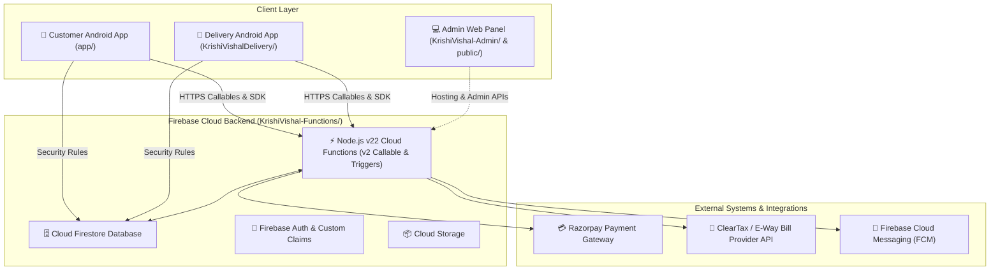
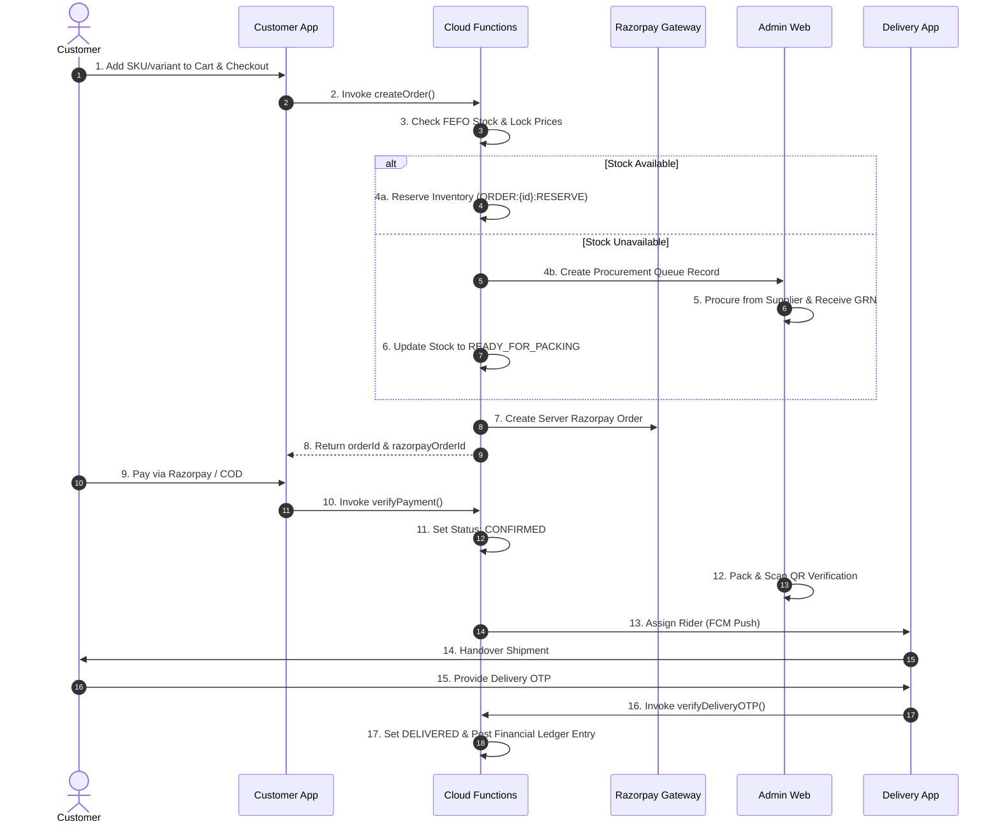

# 🌾 KrishiVishal

**KrishiVishal** is an enterprise-grade agricultural supply chain and e-commerce platform designed for agricultural inputs such as insecticides, fungicides, herbicides, micro-nutrients, seeds, and farm equipment. The ecosystem seamlessly connects farmers, field riders/delivery personnel, and supply chain administrators through native Android applications, React admin infrastructure, and a serverless Firebase Cloud Functions backend.

---

## 📑 Project Overview & Scope

KrishiVishal handles the complete end-to-end lifecycle of agricultural input supply chains:
- **Direct Input Purchasing (Customer Android App):** Farmers browse and order verified agricultural inputs (Insecticides, Seeds, Micro Nutrients, Sprayers) via a native Android app.
- **Inventory & FEFO Stock Management:** Warehouse operations follow First-Expiry-First-Out (FEFO) batch allocation to ensure chemical and seed freshness.
- **Procurement & Goods Receipt (GRN):** Automatic procurement queueing for on-demand items, vendor linkage, and inventory/accounting reconciliation upon receipt.
- **Last-Mile Delivery & Rider Dispatch:** Delivery personnel use a dedicated rider app with OTP delivery confirmation, POD evidence, and COD collection workflows.
- **Double-Entry Financial Accounting:** Automated posting to a double-entry ledger for sales revenue, GST liabilities, rider COD liabilities, wallet balances, and inventory valuation.
- **Self-Service Returns & Refunds:** Verified 7-day return policy with automated Razorpay online refunds and wallet credits.

---

## 🏗️ Architecture Overview



---

## 📱 Applications & Component Modules

| Component / Module | Language / Framework | Implementation Status | Path |
|---|---|---|---|
| **Customer Android App** | Kotlin 2.0.21, Jetpack Compose, Material3, Hilt 2.52, Room 2.8.4 | **Implemented** | [`app/`](app/) |
| **Delivery Rider App** | Kotlin, Jetpack Compose, Room DB, Google Maps SDK | **Implemented** | [`KrishiVishalDelivery/`](KrishiVishalDelivery/) |
| **Firebase Cloud Backend** | Node.js 22, Firebase Functions v2 (`asia-south1`) | **Implemented** | [`KrishiVishal-Functions/`](KrishiVishal-Functions/) |
| **Shared Core Domain** | Kotlin 2.0.21, Models & Room Entities | **Implemented** | [`core/`](core/) |
| **Admin Web Panel** | React / Firebase Hosting (`public/`) | **Implemented** | [`public/`](public/) |

---

### 1. 🛒 Customer Android App (`app/`)
- **Core Tech:** Kotlin 2.0.21, Jetpack Compose, Hilt Dependency Injection, Room Local Database, Coroutines & Flow, Retrofit 2.11.0, Firebase SDK 33.1.2.
- **Features:**
  - Dynamic home feed with category and brand discovery (*Insecticides*, *Seeds*, *Micro Nutrients*).
  - 2×2 product listing grid with search and recent view history.
  - Product details displaying composition, dosage, active ingredients, safety instructions, and pack sizes/SKUs.
  - Cart → address selection → delivery slot → coupon/wallet → Razorpay online payment / COD → order tracking.
  - Authenticated 7-day return request submission (`requestReturn`).

### 2. 🚚 Delivery / Rider Android App (`KrishiVishalDelivery/`)
- **Core Tech:** Kotlin, Jetpack Compose, Room DB, Google Maps Location SDK, Firebase Cloud Messaging (FCM).
- **Features:**
  - Real-time order assignment and FCM push notifications.
  - Rider order acceptance, route mapping, and status updates.
  - Delivery OTP verification (`verifyDeliveryOTP`).
  - Cash-on-Delivery (COD) cash collection workflow and rider deposit liability tracking.
  - Return pickup inspection and Quality Check (QC) proof capture.
  - Offline Room database caching for rural route support.

### 3. ⚙️ Firebase Backend & Cloud Functions (`KrishiVishal-Functions/`)
- **Runtime:** Node.js 22, Firebase Functions v2 (`asia-south1`), Firebase Admin SDK 12, Razorpay SDK 2.9.8.
- **Modules & Key Functions:**
  - **Orders (`orders/`):**
    - `createOrder`: Server-side price locking, Razorpay Order ID generation, atomic order creation, stock reservation.
    - `cancelOrder`: Server-validated cancellation with stock release.
    - `verifyDeliveryOTP`: Server-validated single-use OTP check for delivery completion.
    - `requestReturn`: 7-day policy enforcement & return document creation.
    - `updateOrderStatus`: Order lifecycle state management.
    - `onOrderStatusUpdate`, `onReturnRequestCreated`, `onOrderDeliveryUpdate`, `onProcurementQueueUpdated`.
  - **Finance & Ledger (`finance/`):**
    - `verifyPayment`: Timing-safe HMAC signature verification.
    - `razorpayWebhook`: Payment event reconciliation.
    - `initiateRefund`: Idempotent Razorpay refund & COD wallet credit.
    - `onOrderPaidLedger`, `onReturnCompletedLedger`, `onGoodsReceiptCreated`, `onCashDepositVerified`.
  - **Inventory & GRN (`inventory/`):**
    - `importSkus`, `upsertSku`, `adjustInventory`, `receiveGrn`, `writeOffStock`, `onReturnStockSync`, `onSkuWrite`.
  - **Admin, AI & Compliance (`admin/`, `index.js`):**
    - `aiSupervisor`, `processAiAction`, `monitorOrderSLA`, `generateEWayBill`.

---

## 🔄 Target End-to-End Business Flow



---

## 🚥 Canonical Order State Machine

Order state transitions follow strict server-authoritative logic:

| Status | Trigger / Condition | Source / Updated By |
|---|---|---|
| `PLACED` | Initial state for self-stock orders | `createOrder` |
| `PROCUREMENT_PENDING` | Initial state when on-demand items require supplier procurement | `createOrder` |
| `CONFIRMED` | Payment verified via Razorpay HMAC or COD order validated | `verifyPayment` / `razorpayWebhook` |
| `READY_FOR_PACKING` | Procurement queue items fulfilled via GRN receipt | `onProcurementQueueUpdated` |
| `PACKED` | Warehouse picking and scan checklist completed | `updateOrderStatus` |
| `READY_FOR_PICKUP` | Order staged at warehouse dispatch hub | `updateOrderStatus` |
| `RIDER_ASSIGNED` | Delivery rider assigned to shipment | `onOrderDeliveryUpdate` |
| `OUT_FOR_DELIVERY` | Rider accepts assignment and departs for delivery | Delivery Rider App |
| `DELIVERED` | OTP verified successfully at customer site | `verifyDeliveryOTP` |
| `CANCELLED` | Order cancelled before dispatch | `cancelOrder` |
| `RETURN_REQUESTED` | Customer submitted return within 7-day window | `requestReturn` |
| `RETURNED` | Return pickup and Quality Check (QC) completed | `onReturnStockSync` |

---

## 📦 Inventory Engine & FEFO Allocation

- **Single Source of Truth (SSoT):** `skus` collection represents the authoritative inventory master. Read-heavy customer listings are projected in `products`.
- **FEFO Batch Allocation:** Batches are sorted by nearest `expiryDate`. Stock is atomically reserved (`reserveOrderStock`).
- **Stock Lifecycle:** Available Stock $\rightarrow$ Reserved Stock $\rightarrow$ Completed Stock (Deducted).
- **Idempotency Safeguards:** Transactions log idempotency keys (`ORDER:{orderId}:RESERVE`) in `idempotency_keys` to prevent duplicate stock mutations.
- **Goods Receipt Note (GRN):** `receiveGrn` updates batch quantities/cost and triggers double-entry ledger posting (`onGoodsReceiptCreated`).

---

## 💳 Payments, COD & Double-Entry Financial Ledger

### Payment Security
- **Server-Side Price Locking:** Razorpay Order IDs are created exclusively on the server (`createRazorpayOrder`). Amounts are locked in paise to prevent client-side tampering.
- **Timing-Safe HMAC Verification:** `verifyPayment` validates signatures using `crypto.timingSafeEqual`.

### Double-Entry Chart of Accounts
All financial transactions generate idempotent ledger postings in the `ledger` collection:

| Account Name | Account Type | Increase Side | Description |
|---|---|---|---|
| `CASH_IN_HAND` | Asset | DEBIT | Cash held by riders or warehouse cash drawers |
| `BANK_ACCOUNT` | Asset | DEBIT | Bank account for online payments & deposits |
| `INVENTORY_VALUE` | Asset | DEBIT | Total asset valuation of stock |
| `WALLET_BALANCE` | Liability | CREDIT | Customer wallet credits for returns/refunds |
| `GST_PAYABLE` | Liability | CREDIT | Tax liabilities collected on sales |
| `SALES` | Revenue | CREDIT | Recognized sales revenue |
| `ACCOUNTS_PAYABLE` | Liability | CREDIT | Vendor liabilities for goods received via GRN |

- **Sales Posting (`onOrderPaidLedger`):** Debits `BANK_ACCOUNT` / `CASH_IN_HAND`, Credits `SALES` & `GST_PAYABLE`.
- **Rider COD Reconciliation (`onCashDepositVerified`):** Transfers liability from rider cash account to verified bank/hub account upon deposit verification.

---

## 🔐 Security & Compliance

- **Firestore & Storage Rules:** Enforces role-based access (`isAdmin()`, `isRider()`, `isAuthenticated()`) and document immutability on sensitive collections (`ledger`, `audit_logs`).
- **App Check & Certificate Pinning:** Enforced across mobile clients to protect Firebase endpoints against unauthorized client access.
- **Secrets Handling:** All credentials (Razorpay, ClearTax) are managed strictly via environment variables/Secret Manager.

---

## 🔑 Environment Variables

Required environment variables for `KrishiVishal-Functions`:

```env
# Razorpay Payment Credentials
RAZORPAY_KEY_ID=<your_razorpay_key_id>
RAZORPAY_KEY_SECRET=<your_razorpay_key_secret>
RAZORPAY_WEBHOOK_SECRET=<your_razorpay_webhook_secret>

# Security & Compliance
QR_HMAC_SECRET=<your_qr_hmac_secret>
CLEARTAX_AUTH_TOKEN=<your_cleartax_auth_token>
```

---

## 🛠️ Local Setup, Testing & Deployment

### 1. Backend Setup & Testing (`KrishiVishal-Functions/`)
```bash
# Navigate to Cloud Functions directory
cd KrishiVishal-Functions

# Install Node.js dependencies
npm install

# Run unit and integration tests
npm test

# Deploy Cloud Functions and Firestore Security Rules
firebase deploy --only functions,firestore:rules,storage:rules
```

### 2. Android App Builds
```bash
# Build Customer Android App
./gradlew :app:assembleRelease

# Build Delivery Rider App
./gradlew :KrishiVishalDelivery:app:assembleRelease
```

---

## 📊 Production Readiness & Verification Status

| Verification Area | Status | Verified Capabilities |
|---|---|---|
| **Static & Code Validation** | **VERIFIED** | Kotlin compilation, Gradle build, Cloud Functions unit tests (`npm test` passes). |
| **Customer Order Flow** | **VERIFIED** | Cart $\rightarrow$ Checkout $\rightarrow$ `createOrder` $\rightarrow$ Razorpay lock $\rightarrow$ `verifyPayment` $\rightarrow$ Order `CONFIRMED`. |
| **Self-Stock Flow** | **VERIFIED** | FEFO stock reservation $\rightarrow$ Packing $\rightarrow$ Rider assignment $\rightarrow$ Delivery OTP $\rightarrow$ Ledger posting. |
| **On-Demand & GRN Flow** | **VERIFIED** | Stock check $\rightarrow$ `procurement_queue` creation $\rightarrow$ GRN receipt (`receiveGrn`) $\rightarrow$ Stock update $\rightarrow$ `READY_FOR_PACKING`. |
| **COD Deposit & Reconciliation** | **VERIFIED** | Rider cash collection $\rightarrow$ Deposit submission $\rightarrow$ Verification trigger (`onCashDepositVerified`) $\rightarrow$ Liability cleared. |
| **Financial Idempotency** | **VERIFIED** | Idempotency keys protect duplicate payment webhooks and duplicate GRN accounting entries. |

---

## 📌 Known Limitations

1. **GSP E-Way Bill Provider:** `generateEWayBill` requires active production GSP API credentials configured in `CLEARTAX_AUTH_TOKEN`.
2. **Offline Rider Sync:** Rider app supports offline caching via Room DB; pending uploads retry automatically when network connectivity is restored.

---

## 📄 License

This project is proprietary software developed for **KrishiVishal Agri-Solutions**. All rights reserved.
