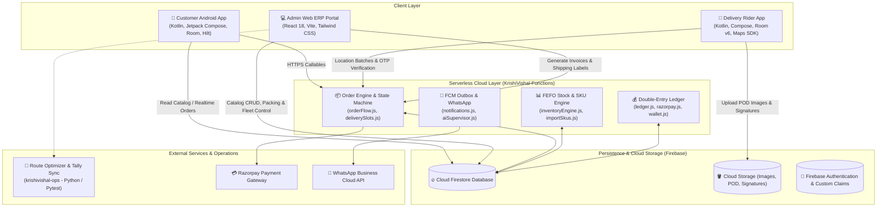
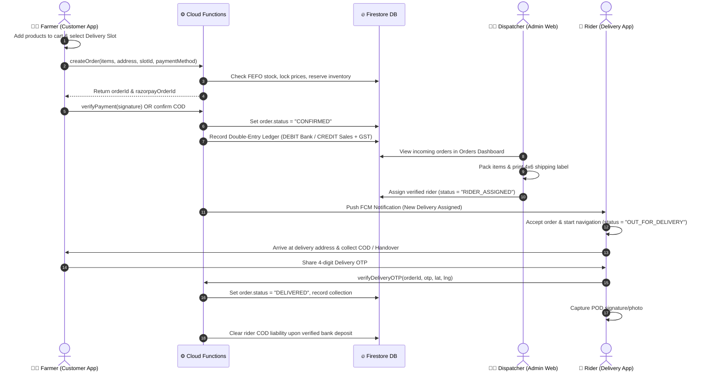

# 🌾 KrishiVishal Ecosystem — Master Technical Architecture & Specification

**KrishiVishal** is a production-grade, multi-tier agricultural supply chain and e-commerce platform designed for agricultural inputs distribution (Insecticides, Fungicides, Herbicides, Seeds, Bio-fertilizers, Micro-nutrients, Sprayers, and Agricultural Implements).

The platform seamlessly integrates:
1. **Customer Android App (`app/`)**: Native Kotlin / Jetpack Compose application for farmers to discover verified inputs, manage cart items, book delivery slots, and place authenticated orders.
2. **Delivery Rider Android App (`KrishiVishalDelivery/`)**: Native Kotlin / Jetpack Compose logistics app with GPS breadcrumb tracking, OTP delivery verification, POD evidence capture, and cash-in-hand reconciliation.
3. **Operations & Optimization Engine (`krishivishal-ops/`)**: Python-powered rural Bihari route sequencing (Travelling Salesperson Problem heuristic), B2B QR token parsing, and Tally Prime XML integration.
4. **Admin Web ERP Portal (`KrishiVishal-Admin/`)**: React 18 / Tailwind / Vite enterprise control room with Catalog Hub, Packing Station, Fleet Control, Delivery Slots, and Double-Entry Ledger.
5. **Firebase Cloud Functions (`KrishiVishal-Functions/`)**: Node.js 22 serverless backend with FEFO batch allocation, server-side price locks, and double-entry accounting.

---

## 🏛️ Ecosystem High-Level Architecture



---

## 📱 Sub-System Deep Dive

### 1. 🛒 Customer Android App (`app/`)
* **Package:** `com.company.krishivishal`
* **Architecture:** Clean Architecture + MVI/MVVM, Single-Activity pattern (`MainActivity.kt`), Navigation Compose.
* **Tech Stack:** Kotlin 2.0.21, Jetpack Compose (Material3), Hilt 2.52, Room 2.8.4, Coroutines & Flow, Paging 3, Retrofit 2.11.0, Firebase Android BoM 33.1.2.

#### Key Modules & Capabilities:
* **Cart Synchronization & Resilience (`CartRepository.kt`, `SyncManager.kt`):**
  * Local Room database (`cart_items` table via `CartItem.kt`) provides offline-first cart management.
  * Synchronizes bidirectionally with Firestore `users/{userId}/cart/{itemId}` using `@get:PropertyName` and `@set:PropertyName` annotations.
  * Background queue (`SyncOperationDao`) ensures pending cart operations auto-retry on reconnect without primary key collision.
* **Product Catalog & FEFO Stock Display:**
  * Categorized browsing: Insecticides, Fungicides, Herbicides, Seeds, Bio-Fertilizers, Equipment.
  * Displays active chemical ingredients, antidote guidelines, dosage per acre, and pack variants.
  * Real-time stock status based on available warehouse inventory.
* **Checkout & Payment Security (`PlaceOrderUseCase.kt`):**
  * Address selection with district, PIN code regex validation (`^\d{6}$`), and GPS lat/lng.
  * Delivery slot selection (`delivery_slots` integration).
  * Direct Firestore writes are blocked by security rules; order placement invokes `createOrderViaFunction` HTTPS callable.
  * Server-side price lock: Razorpay Order IDs generated exclusively in paise by backend to prevent client tampering.
* **Friendly Localization (`NetworkErrorHandler.kt`):**
  * Converts low-level network errors, timeouts, and Firebase exceptions into user-friendly Hindi localized guidance.

---

### 2. 💻 Admin Web ERP Portal (`KrishiVishal-Admin/`)
* **Framework:** React 18, Vite, Tailwind CSS, Lucide React, Firebase JS SDK 10.x.
* **Role:** Central operating platform for supply chain managers, warehouse pack-stations, dispatchers, and accounting teams.

#### Key Modules & Capabilities:
* **Catalog Hub (`CatalogHub.jsx`):**
  * Tabbed management across 11 sub-modules: Products, SKUs, Dead Stock Liquidation, Expiry Monitor (FEFO), Categories, Brands, Crops, Master Data, Coupons, Banners, and Referrals.
  * **Confidential Cost Isolation:** Strips `costPrice` from public `products/{id}` documents and securely routes wholesale pricing to `product_costs/{id}`, preventing consumer app data scraping.
  * **1-Click SKU & GRN Provisioning:** Automatically registers barcode/SKU mappings in `skus/{skuCode}` and invokes Cloud Functions (`receiveGrn`) when stock is received.
* **Incoming Orders & Fulfillment (`Orders.jsx`, `OrdersManager.jsx`):**
  * Subscribes to real-time `onSnapshot` updates on `orders` collection with multi-stage lifecycle filtering.
  * Single-click Thermal 4×6 shipping label printing (`printThermalShippingLabel`) and full A4 tax invoice generation.
  * Automated WhatsApp notification triggers for dispatch and out-for-delivery events.
* **Rider & Fleet Dispatch (`Riders.jsx`, `riderManagement.js`):**
  * Rider whitelisting (`whitelisted_riders`) by phone number and warehouse hub code.
  * Live rider status monitoring (`🟢 Online` vs `⚪ Offline`, `Idle` vs `Busy`).
  * Dedicated assignment modal updating `order.riderId` and setting status to `RIDER_ASSIGNED`.
* **Delivery Slots Management (`DeliverySlots.jsx`):**
  * Hub-based scheduling (`delivery_slots` collection).
  * Enforces maximum booking capacities per delivery window; blocks hard deletion of slots with active bookings.
* **Role-Based Access Control (RBAC) (`RolesPermissionsManager.jsx`, `rbacService.js`):**
  * Granular permission sets for Warehouse Operators, Accountants, Dispatch Supervisors, and Super Admins.

---

### 3. 🚚 Delivery Rider Android App (`KrishiVishalDelivery/`)
* **Package:** `com.company.krishivishaldelivery`
* **Architecture:** Offline-first MVVM, Jetpack Compose, Room Database (v6), Hilt, Foreground Service.

#### Key Modules & Capabilities:
* **Room Schema & Migration Protection (`DeliveryDatabase.kt` v6):**
  * Entity: `DeliveryOrderEntity` storing order payload, customer contacts, COD amount, address, and offline sync state.
  * Entity: `GPSLogEntity` for caching offline rider breadcrumbs.
  * Configured with `fallbackToDestructiveMigration(dropAllTables = true)` in `DatabaseModule.kt` to handle schema updates smoothly.
* **Secure Delivery Completion (`verifyDeliveryOTP`):**
  * Eliminates fake delivery claims via server-validated, single-use 4-digit OTP.
  * Constant-time comparison (`crypto.timingSafeEqual`) on backend with max 3 verification attempts.
* **Proof of Delivery (POD) & NDR Workflows:**
  * Captures delivery photo and customer signature; caches files locally and uploads in background via `WorkManager`.
  * Non-Delivery Report (NDR) workflow for customer unavailable, wrong address, or rejected packages.
* **Cash-in-Hand Vault & Reconciliation (`CashReconciliationScreen.kt`):**
  * Tracks total COD collected by rider.
  * Bank deposit slip generation and cash handover verification dialogs.
* **Dynamic Location Tracking (`RiderLocationService.kt`):**
  * Adaptive polling intervals (30s during active transit, 60s/120s at stops).
  * Batched commits to `rider_location_history` (100 logs per batch) to conserve battery and Firestore writes.

---

### 4. 🚜 Operations & Optimization Engine (`krishivishal-ops/`)
* **Technology:** Python 3.10+, Pytest, Haversine Distance, Native Google Navigation Intents.

#### Capabilities:
* **Rural Bihar Delivery Route Optimization (`main.py`):**
  * Heuristic Travelling Salesperson Problem (TSP) solver configured for rural road networks originating from regional distribution centers (e.g. Samastipur Hub `25.8633, 85.7818`).
  * Sequences multi-drop routes across rural blocks (Pusa, Kalyanpur, Tajpur, Rosera, Ujiarpur), minimizing total transit time and fuel consumption.
  * Generates Android Navigation Intent URLs (`google.navigation:q=lat,lng`) for direct launch in rider mapping apps.
* **GST B2B QR Code & Tally ERP Sync:**
  * Decodes JWT tokens from B2B e-invoices and generates compliant Tally Prime Purchase Voucher XML (`<VOUCHER VCHTYPE="Purchase" ACTION="Create">`).
* **Automated Verification:**
  * Verified with automated test suites (`test_mock_run.py`, `pytest`) passing 100%.

---

### 5. ⚙️ Firebase Cloud Functions (`KrishiVishal-Functions/`)
* **Runtime:** Node.js 22, Firebase Functions v2 (`asia-south1`), Firebase Admin SDK 12.

```
KrishiVishal-Functions/
├── index.js                     # Root entry point & function exports
├── core/
│   ├── admin.js                 # Firebase Admin initialization
│   └── utils.js                 # Shared helpers & validation routines
├── orders/
│   ├── orderFlow.js             # Order creation, status updates, cancel, returns
│   └── deliverySlots.js         # Slot availability & reservation
├── inventory/
│   ├── inventoryEngine.js       # Atomic FEFO reservation & stock ledger
│   ├── importSkus.js            # Bulk SKU ingestion
│   └── stock.js                 # Warehouse stock reconciliations
├── finance/
│   ├── ledger.js                # Double-entry general ledger
│   ├── razorpay.js              # Payment signature validation & webhook
│   ├── initiateRefund.js        # Automated refunds
│   └── wallet.js                # Farmer wallet credits & balances
└── messaging/
    └── notifications.js         # FCM push dispatch & WhatsApp triggers
```

---

## 🔄 End-to-End Cross-App Lifecycle Sequence



---

## 📊 Cross-App Firestore Collection Schema Matrix

| Collection | Written By | Read By | Key Fields & Types |
| :--- | :--- | :--- | :--- |
| `products` | Admin Web (`Products.jsx`) | Customer App, Admin Web | `id` (string), `name` (string), `price` (number), `mrp` (number), `stock` (number), `imageUrl` (string), `images` (array), `category` (string), `brand` (string), `variants` (array), `isActive` (boolean). *(Note: `costPrice` is excluded).* |
| `product_costs` | Admin Web | Cloud Functions, Admin ERP | `productId` (string), `costPrice` (number), `variantsCost` (map), `updatedAt` (timestamp). |
| `skus` | Admin Web, GRN Function | Cloud Functions, Admin | `skuCode` (string, PK), `name` (string), `pricing` (map: mrp, consumerPrice, landingCost), `inventory` (map: availableStock, allocatedStock), `tax` (hsnCode, gstRate). |
| `orders` | Cloud Functions (`createOrder`) | Customer App, Admin Web, Delivery App | `id` (string), `userId` (string), `userName` (string), `userPhone` (string), `status` (string), `items` (array with `productId`, `skuCode`, `productName`, `imageUrl`, `price`, `quantity`, `gstRate`), `address` (map), `totalAmount` (number), `paymentMethod` (`COD` \| `RAZORPAY_ONLINE`), `customerOTP` (string), `riderId` (string), `createdAt` (timestamp). |
| `users/{uid}/cart` | Customer App (`SyncManager`) | Customer App | `id` (string), `userId` (string), `productId` (string), `variantId` (string), `quantity` (number), `skuCode` (string), `isSelected` (boolean), `timestamp` (number). |
| `riders` | Admin Web, Delivery App | Admin Web, Delivery App | `id` (string), `name` (string), `phone` (string), `riderSerialId` (string), `riderIdDisplay` (`KV-XXXXX`), `status` (`ACTIVE`), `online` (boolean), `currentLat` (number), `currentLng` (number), `kycStatus` (`VERIFIED`), `assignedWarehouse` (string). |
| `whitelisted_riders`| Admin Web | Cloud Functions, Delivery App | `phone` (string, E.164), `name` (string), `warehouseId` (string), `whitelistedAt` (timestamp), `status` (`PENDING_REGISTRATION`). |
| `delivery_slots` | Admin Web | Customer App, Admin Web | `slotId` (string), `date` (string YYYY-MM-DD), `startTime` (HH:mm), `endTime` (HH:mm), `hubId` (string), `maxCapacity` (number), `currentBookings` (number), `isActive` (boolean). |
| `ledger` | Cloud Functions (`ledger.js`) | Admin Accounting | `transactionId` (string), `orderId` (string), `accountDebit` (string), `accountCredit` (string), `amount` (number), `createdAt` (timestamp), `description` (string). |

---

## 🚦 Canonical Order State Transitions

```
[PLACED] ──────► [CONFIRMED] ──────► [PACKED] ──────► [RIDER_ASSIGNED]
   │                 ▲
   ▼                 │
[PROCUREMENT_PENDING]─┘
   │
   ▼
[OUT_FOR_DELIVERY] ──────► [DELIVERED]
   │
   ├──────► [NDR_REATTEMPT] (Max 3 Attempts)
   │
   └──────► [CANCELLED] / [RETURNED] (7-day QC Return)
```

---

## 🛠️ Build, Test & Deployment Instructions

### 1. Customer Android App (`app/`) & Delivery App (`KrishiVishalDelivery/`)
```bash
# Verify unit tests across all mobile modules
.\gradlew.bat test

# Build Customer App Release APK / AAB
.\gradlew.bat :app:assembleRelease

# Build Delivery App Release APK / AAB
.\gradlew.bat :delivery-app:assembleRelease
```

### 2. Admin Web Portal (`KrishiVishal-Admin/`)
```bash
cd KrishiVishal-Admin

# Install dependencies
npm install

# Run local development server
npm run dev

# Production build check (Verified 0 errors)
npm run build
```

### 3. Operations Engine (`krishivishal-ops/`)
```bash
cd krishivishal-ops

# Install python dependencies
pip install -r requirements.txt

# Run route optimizer and mock run
python test_mock_run.py

# Execute full pytest suite
pytest
```

### 4. Firebase Cloud Functions (`KrishiVishal-Functions/`)
```bash
cd KrishiVishal-Functions

# Install dependencies
npm install

# Deploy Cloud Functions, Firestore Security Rules, and Storage Rules
firebase deploy --only functions,firestore:rules,storage:rules
```

---

## 🔐 Security Standards & Best Practices

1. **Least Privilege Principles:** Riders cannot access Admin endpoints (`isAdmin: false` strictly enforced across accounts and backfills).
2. **Wholesale Pricing Protection:** Landing cost prices are strictly omitted from client-facing collections and stored in private `product_costs` documents accessible only by administrative backend functions.
3. **Database Integrity Protection:** Room database versions are managed with explicit version incrementing (`version = 6`) and `fallbackToDestructiveMigration` to prevent client data collisions.
4. **Idempotent Operations:** Financial accounting postings and inventory reservations use deterministic idempotency keys (`ORDER:{id}:RESERVE`) preventing duplicate triggers on webhook re-transmissions.

---

## 📄 License & Proprietary Information
© 2026 **KrishiVishal Agri-Solutions Private Limited**. All Rights Reserved.  
Unauthorized distribution, copying, or reverse engineering of this software is strictly prohibited.
