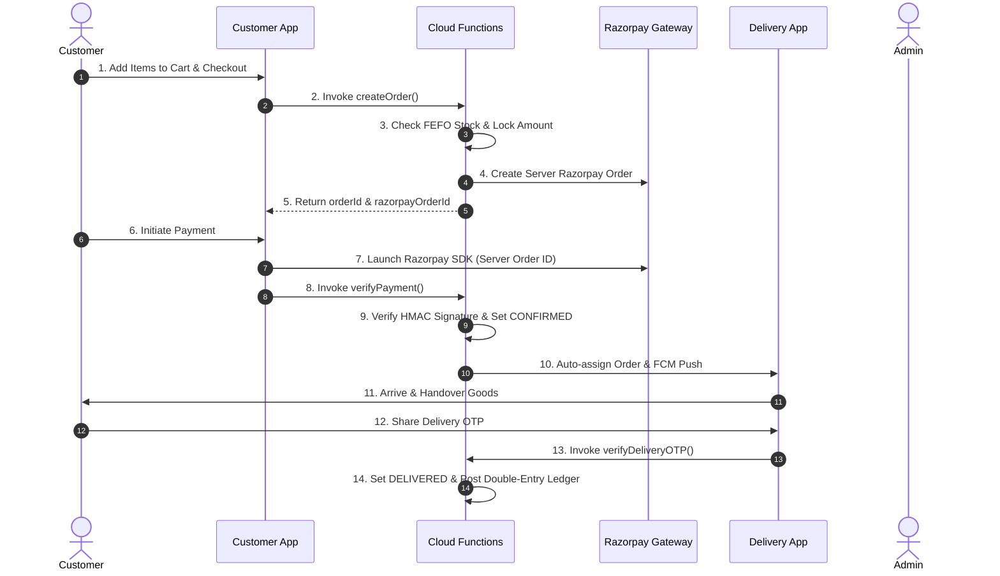

# 🌾 KrishiVishal

**KrishiVishal** is a full-stack, enterprise-grade agricultural supply chain and e-commerce platform designed for agricultural inputs such as insecticides, fungicides, herbicides, micro-nutrients, seeds, and farm equipment. The ecosystem seamlessly connects farmers, field riders/delivery personnel, and supply chain administrators through native Android applications and serverless Firebase backend infrastructure.

---

## 📑 Overview

KrishiVishal handles the complete end-to-end lifecycle of agricultural input supply chains:
- **Direct Input Purchasing:** Farmers browse and order verified agricultural inputs (Insecticides, Seeds, Micro Nutrients, Sprayers) via a native Android app.
- **Inventory & FEFO Stock Management:** Warehouse operations follow First-Expiry-First-Out (FEFO) batch allocation to ensure chemical and seed freshness.
- **Procurement & Goods Receipt (GRN):** Automatic procurement queueing for on-demand items and stock reconciliation upon receipt.
- **Last-Mile Delivery & Rider Dispatch:** Delivery personnel use a dedicated rider app with OTP delivery confirmation and COD collection.
- **Double-Entry Financial Accounting:** Automated posting to a double-entry ledger for sales revenue, GST liabilities, wallet balances, and inventory valuation.
- **Self-Service Returns & Refunds:** Verified 7-day return policy with automated Razorpay online refunds and wallet credits.

---

## 🏗️ Platform Architecture

```mermaid
graph TD
    subgraph Client Layer
        A["📱 Customer Android App (/app)"]
        B["🚚 Delivery Android App (/KrishiVishalDelivery)"]
        C["💻 Admin Web Directory (/public - Configured)"]
    end

    subgraph Firebase Cloud Backend (KrishiVishal-Functions)
        D["⚡ Node.js v22 Cloud Functions (v2 Callable & Triggers)"]
        E["🗄️ Cloud Firestore Database"]
        F["🔐 Firebase Auth & App Check"]
        G["📦 Cloud Storage"]
    end

    subgraph External Systems & Integrations
        H["💳 Razorpay Payment Gateway"]
        I["📄 ClearTax / E-Way Bill Provider API"]
        J["📲 Firebase Cloud Messaging (FCM)"]
    end

    A -->|HTTPS Callables & SDK| D
    B -->|HTTPS Callables & SDK| D
    C -.->|Hosting Target| E
    A -->|Security Rules| E
    B -->|Security Rules| E
    D <--> E
    D --> H
    D --> I
    D --> J
```

---

## 📱 Applications & Component Modules

| Module / Component | Language / Framework | Implementation Status | Path |
|---|---|---|---|
| **Customer Android App** | Kotlin 2.0.21, Jetpack Compose, Material3, Hilt 2.52, Room 2.8.4 | **Implemented** | [`/app`](file:///c:/Users/visha/AndroidStudioProjects/KrishiVishal/app) |
| **Delivery Rider App** | Kotlin, Jetpack Compose, Room, Google Maps SDK | **Implemented** | [`/KrishiVishalDelivery`](file:///c:/Users/visha/AndroidStudioProjects/KrishiVishal/KrishiVishalDelivery) |
| **Firebase Cloud Backend** | Node.js 22, Firebase Functions v2 (`asia-south1`) | **Implemented** | [`/KrishiVishal-Functions`](file:///c:/Users/visha/AndroidStudioProjects/KrishiVishal/KrishiVishal-Functions) |
| **Shared Core Domain** | Kotlin 2.0.21, Models & Room Entities | **Implemented** | [`/core`](file:///c:/Users/visha/AndroidStudioProjects/KrishiVishal/core) |
| **Admin Web Frontend** | Firebase Hosting Target (`public/`) | **Configured (Backend APIs Implemented)** | [`/public`](file:///c:/Users/visha/AndroidStudioProjects/KrishiVishal/public) |

---

### 1. 🛒 Customer Android App (`/app`)
- **Core Tech:** Kotlin 2.0.21, Jetpack Compose, Hilt Dependency Injection, Room Local Database, Coroutines & Flow, Retrofit 2.11.0, Firebase SDK 33.1.2.
- **Implemented Features:**
  - Dynamic home feed with seasonal category recommendations (*Insecticides*, *Seeds*, *Micro Nutrients*).
  - Search, product detail view, and variant selection.
  - Multi-item cart management and checkout with real-time total & tax computation.
  - Server-side Razorpay online payment integration (`razorpayOrderId` amount lock protection) & Cash on Delivery (COD).
  - Secure customer order history & real-time delivery state updates.
  - Customer 7-day return request submission (`requestReturn` Cloud Function).

### 2. 🚚 Delivery / Rider Android App (`/KrishiVishalDelivery`)
- **Core Tech:** Kotlin, Jetpack Compose, Room DB, Google Maps Location SDK, Firebase Cloud Messaging (FCM).
- **Implemented Features:**
  - Real-time return and delivery assignment via FCM push notifications.
  - Delivery OTP verification (`verifyDeliveryOTP`).
  - Cash-on-Delivery (COD) cash collection workflow.
  - Customer return pickup inspection & Quality Check (QC) photo capture.
  - Offline Room database caching for low-connectivity rural routes.

### 3. ⚙️ Firebase Cloud Backend (`/KrishiVishal-Functions`)
- **Runtime:** Node.js 22, Firebase Functions v2 (`asia-south1` region), Firebase Admin SDK 12, Razorpay SDK 2.9.8.
- **Implemented Functions & Modules:**
  - **Orders (`orders/orderFlow.js` & `orderTriggers.js`):**
    - `createOrder`: Server-side price locking, Razorpay Order ID generation (`createRazorpayOrder`), atomic order creation, FEFO stock reservation.
    - `cancelOrder`: Server-validated cancellation with stock release.
    - `verifyDeliveryOTP`: Secure OTP verification for last-mile delivery completion.
    - `requestReturn`: Authenticated 7-day return policy validation & return request creation.
    - `updateOrderStatus`: Admin/Rider order state transitions.
    - `onOrderStatusUpdate`, `onReturnRequestCreated`, `onOrderDeliveryUpdate`, `onProcurementQueueUpdated`.
  - **Finance & Payments (`finance/`):**
    - `verifyPayment`: Timing-safe HMAC signature verification & payment status update.
    - `razorpayWebhook`: Asynchronous payment reconciliation.
    - `initiateRefund`: Admin-triggered Razorpay online refund & COD wallet credit with idempotency guards.
    - `payWithWallet`: Wallet payment transaction processing.
    - `onOrderPaidLedger`, `onReturnCompletedLedger`, `onGoodsReceiptCreated`, `onCashDepositVerified`.
  - **Inventory (`inventory/`):**
    - `onReturnStockSync`, `onSkuWrite`, `importSkus`, `upsertSku`, `adjustInventory`, `receiveGrn`, `writeOffStock`, `getInventoryReport`.
  - **Admin & AI (`admin/`):**
    - `aiSupervisor`, `processAiAction`, `monitorOrderSLA`.
  - **Compliance (`index.js`):**
    - `generateEWayBill`: E-Way Bill generation via GSP provider interface.

---

## 🔄 End-to-End Business Flow



---

## 🚥 Order State Machine

The repository enforces the following order statuses:

| Status | Trigger / Condition | Transitioned By |
|---|---|---|
| `PLACED` | Initial state for self-stock orders | `createOrder` |
| `PROCUREMENT_PENDING` | Initial state when on-demand items are present | `createOrder` |
| `CONFIRMED` | Payment verified via Razorpay or COD validated | `verifyPayment` / `razorpayWebhook` |
| `READY_FOR_PACKING` | Procurement queue items fulfilled | `onProcurementQueueUpdated` |
| `PACKED` | Warehouse packing checklist completed | `updateOrderStatus` |
| `READY_FOR_PICKUP` | Order staged at pickup dispatch point | `updateOrderStatus` |
| `RIDER_ASSIGNED` | Delivery rider assigned to order | `onOrderDeliveryUpdate` |
| `OUT_FOR_DELIVERY` | Rider departed with shipment | Rider App |
| `DELIVERED` | OTP verified successfully at delivery point | `verifyDeliveryOTP` |
| `CANCELLED` | User/Admin cancelled prior to dispatch | `cancelOrder` |
| `RETURN_REQUESTED` | Customer submitted return within 7 days | `requestReturn` |
| `RETURNED` | Return pickup & QC completed | `onReturnStockSync` |

---

## 📦 Inventory Engine & FEFO Allocation

The warehouse inventory engine (`inventory/inventoryEngine.js`) enforces strict authoritative stock management:
- **Authoritative Warehouse:** Primary fulfillment hub (`WH-PURNEA-01`).
- **FEFO Allocation:** Batches sorted by nearest `expiryDate`. Stock is reserved atomically (`reserveOrderStock`).
- **Stock States:** Available Stock $\rightarrow$ Reserved Stock $\rightarrow$ Completed Stock (Deducted).
- **Idempotency Safeguards:** Idempotency keys (`ORDER:{orderId}:RESERVE`) stored in `idempotency_keys` collection to prevent double allocation.
- **Goods Receipt (GRN):** `receiveGrn` updates batch quantities and triggers ledger posting (`onGoodsReceiptCreated`).

---

## 💳 Payment, Refunds & Double-Entry Ledger

### Payment Security
- **Server-Side Price Lock:** Razorpay Order IDs generated exclusively on the server (`createRazorpayOrder`). Amounts are locked in paise to prevent client-side price tampering.
- **Timing-Safe Verification:** Payment signatures verified using `crypto.timingSafeEqual` in `verifyPayment`.

### Double-Entry Accounting Chart of Accounts
Financial transactions automatically post to the `ledger` collection following standard accounting principles:

| Account Name | Account Type | Increase Side |
|---|---|---|
| `CASH_IN_HAND` | Asset | DEBIT |
| `BANK_ACCOUNT` | Asset | DEBIT |
| `INVENTORY_VALUE` | Asset | DEBIT |
| `WALLET_BALANCE` | Liability | CREDIT |
| `GST_PAYABLE` | Liability | CREDIT |
| `SALES` | Revenue | CREDIT |
| `ACCOUNTS_PAYABLE` | Liability | CREDIT |

- **Sales Posting (`onOrderPaidLedger`):** Debits `BANK_ACCOUNT` / `CASH_IN_HAND`, Credits `SALES` & `GST_PAYABLE`.
- **Return Completion (`onReturnCompletedLedger`):** Reverses revenue/liability and credits customer wallet or initiates Razorpay refund.

---

## 🔐 Security & Compliance

- **Firestore Security Rules:** Role-based access controls (`isAdmin()`, `isRider()`, `isAuthenticated()`) with field immutability constraints.
- **App Check & Certificate Pinning:** Configured in Android build (`PIN_FIRESTORE_PRIMARY`, `PIN_STORAGE_PRIMARY`).
- **Secret Management:** Secrets injected via environment variables (never hardcoded in source control).

---

## 🔑 Environment Variables

The following environment variables are referenced by the Cloud Functions runtime:

```env
# Razorpay Credentials
RAZORPAY_KEY_ID=<configured securely>
RAZORPAY_KEY_SECRET=<configured securely>
RAZORPAY_WEBHOOK_SECRET=<configured securely>

# Security & External APIs
QR_HMAC_SECRET=<configured securely>
CLEARTAX_AUTH_TOKEN=<configured securely>
```

---

## 🛠️ Build & Deployment Instructions

### 1. Firebase Backend Deployment
```bash
# Navigate to Cloud Functions directory
cd KrishiVishal-Functions

# Install dependencies
npm install

# Test syntax & test suite
npm test

# Deploy Cloud Functions & Firestore Security Rules
firebase deploy --only functions:initiateRefund,functions:requestReturn,functions:createOrder,firestore
```

### 2. Android App Builds
```bash
# Build Customer Android App
./gradlew :app:assembleRelease

# Build Delivery Rider Android App
./gradlew :KrishiVishalDelivery:app:assembleRelease
```

---

## 📄 License
This project is proprietary software developed for KrishiVishal Agri-Solutions. All rights reserved.
