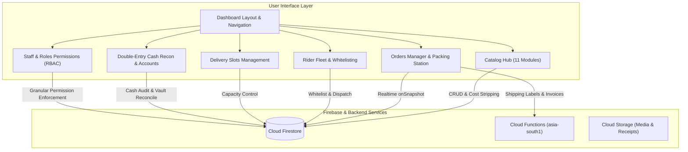

# 🌾 KrishiVishal Admin — Enterprise Operations & ERP Web Portal

**KrishiVishal-Admin** is an enterprise-grade web application built with **React 18**, **Tailwind CSS**, and **Vite**, backed by **Firebase Firestore**, **Cloud Functions v2**, and **Cloud Storage**.

It serves as the central command center for the KrishiVishal agricultural supply chain ecosystem across Bihar regional hubs (Patna, Samastipur, Muzaffarpur, Darbhanga, Begusarai).

---

## 🏗️ Architectural Overview



---

## 📑 Core Functional Modules

### 1. 📦 Catalog Hub (`src/pages/CatalogHub.jsx`)
Central tabbed management interface providing 11 lazy-loaded sub-modules:
- **Products (`Products.jsx`):** Complete CRUD for agricultural inputs. Includes category-specific technical attributes (insecticide formulation, active ingredients, dose per acre, seed germination percentage).
- **Security Partitioning:** Wholesale purchase price (`costPrice`) is automatically removed from the public `products/{id}` payload and stored privately in `product_costs/{id}`.
- **SKU Engine (`SkuDashboard.jsx`):** Manages barcode identifiers, available stock, allocated stock, quarantine stock, and reorder levels.
- **Expiry Monitor & Dead Stock (`ExpiryMonitor.jsx`, `DeadStockLiquidation.jsx`):** Tracks First-Expiry-First-Out (FEFO) batch lifecycles and provides liquidation discounting for near-expiry chemicals.
- **Master Data:** Categories, Brands, Crops, Coupons, Banners, and Referral Rules.

### 2. 📋 Orders & Fulfillment Hub (`src/pages/Orders.jsx`)
- **Real-time Listener:** Uses `onSnapshot` queries with unsubscribe cleanup to listen to live orders from the Customer Android App.
- **Order State Timeline:** Manages transitions: `PLACED` ➔ `CONFIRMED` ➔ `PACKING` ➔ `PACKED` ➔ `RIDER_ASSIGNED` ➔ `OUT_FOR_DELIVERY` ➔ `DELIVERED`.
- **Packaging & Print Tools (`src/utils/PrintService.js`):**
  - Instant thermal 4×6 shipping label printing (`printThermalShippingLabel`).
  - Standard GST-compliant A4 tax invoice generation (`printInvoice`).
- **Customer Alerts:** Direct WhatsApp Cloud API triggers for dispatch updates.

### 3. 🛵 Rider Fleet Control (`src/pages/Riders.jsx`)
- **Phone Whitelisting:** Pre-authorizes rider phone numbers (`whitelisted_riders`) mapped to specific warehouse hubs.
- **KYC Document Verification:** Review and approve government identity and driving licenses.
- **Real-time Availability:** Live status flags (`🟢 Online` vs `⚪ Offline`, `Idle` vs `Busy`).
- **1-Click Rider Assignment:** Assigns active rider to packed orders and triggers background FCM push notifications to the Delivery App.

### 4. ⏰ Delivery Slots Management (`src/pages/DeliverySlots.jsx`)
- **Collection:** `delivery_slots`
- **Document Format:** `SLOT_{date}_{startTime}-{endTime}_{hubId}`
- **Capacity Management:** Sets maximum order quotas per delivery time window to prevent delivery route bottlenecks.
- **Safety Enforcement:** Blocks deletion of slots where `currentBookings > 0`.

### 5. 👥 Staff & Role-Based Access Control (RBAC) (`src/pages/Staff.jsx`, `src/services/rbacService.js`)
- Roles: `SUPER_ADMIN`, `WAREHOUSE_MANAGER`, `DISPATCH_SUPERVISOR`, `ACCOUNTANT`, `PACKING_STAFF`.
- Dynamic module-level and action-level permission enforcement.

### 6. 💵 Cash Reconciliation & Vault Audit (`src/pages/CashRecon.jsx`)
- Audits Cash-on-Delivery (COD) collections remitted by delivery riders.
- Reconciles bank deposit slips against rider mobile vault records.

---

## 🛠️ Local Development & Production Build

```bash
# 1. Install dependencies
npm install

# 2. Start local development server
npm run dev

# 3. Verify production compilation
npm run build
```

---

## 📄 License
© 2026 **KrishiVishal Agri-Solutions Private Limited**. All Rights Reserved.
