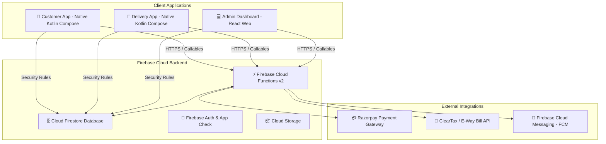
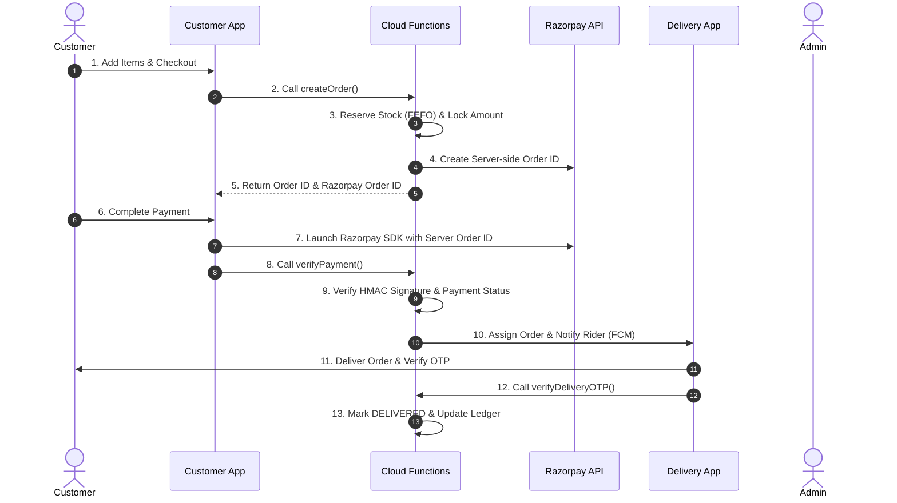

# 🌾 KrishiVishal — Agri-E-Commerce & Supply Chain Enterprise Platform

[](LICENSE)
[](https://developer.android.com)
[](https://firebase.google.com)
[](https://kotlinlang.org)
[](https://nodejs.org)

**KrishiVishal** is a full-stack, enterprise-grade agri-e-commerce and supply chain management platform designed for agricultural inputs (seeds, fertilizers, pesticides, tools) and direct farm produce. The ecosystem seamlessly connects farmers, delivery personnel, warehouse managers, and admins through robust native mobile apps and scalable cloud infrastructure.

---

## 🏗️ System Architecture



---

## 📱 Core Applications & Modules

### 1. 🛒 Customer Mobile App (`/app`)
Native Android application tailored for farmers and buyers with offline-first support and localized UI.
- **Tech Stack:** Kotlin, Jetpack Compose, Hilt DI, Coroutines & Flow, Room Database, Retrofit/Firebase SDK.
- **Features:**
  - Dynamic Product Catalog & Category Browsing with Search Filtering.
  - Multi-item Cart & FEFO Stock-aware Checkout.
  - Razorpay UPI/Cards/Netbanking & COD / Wallet Payment Modes.
  - Real-time Order Tracking & Delivery OTP Verification.
  - Self-service 7-Day Return Request Flow (`requestReturn`).
  - Multilingual & Farmer-friendly UI.

### 2. 🚚 Delivery & Field Rider App (`/KrishiVishalDelivery`)
Dedicated mobile app for supply chain logistics, rider dispatch, and last-mile delivery.
- **Tech Stack:** Kotlin, Jetpack Compose, Google Maps SDK, Room Database, Hilt.
- **Features:**
  - Real-time Route & Order Assignment via FCM Push Notifications.
  - Delivery OTP Verification (`verifyDeliveryOTP`).
  - Cash on Delivery (COD) Collection & Verification Flow.
  - Customer Return Pickup & Quality Check (QC) Photo Upload.
  - Offline-resilient sync with local SQLite (Room) cache.

### 3. 💻 Admin & Operations Panel (`/public` / Cloud Managed)
Web dashboard for inventory control, order dispatch, ledger accounting, and returns management.
- **Features:**
  - Real-time Order Fulfillment & Procurement Queue Monitoring.
  - Stock Adjustment, Batch Expiry & FEFO Management.
  - Return Request Inspection & One-Click Refund Processing (`initiateRefund`).
  - Financial Ledger & Cash Deposit Verification.

### 4. ⚙️ Firebase Backend Engine (`/KrishiVishal-Functions`)
Serverless backend running Node.js 2nd Generation Cloud Functions.
- **Modules:**
  - `orders/orderFlow.js`: Server-side price lock (`createRazorpayOrder`), atomic order creation, FEFO stock reservation, order cancellation, and OTP verification.
  - `orders/orderTriggers.js`: Order state triggers, procurement queue auto-assignment, and rider notifications.
  - `finance/initiateRefund.js`: Admin-triggered automated Razorpay online refunds & COD wallet credits.
  - `finance/razorpay.js`: Secure HMAC timing-safe signature verification & payment webhooks.
  - `finance/ledger.js`: Double-entry accounting ledger & expense management.
  - `inventory/inventoryEngine.js`: FEFO (First-Expiry-First-Out) batch stock reservation engine with idempotency protection.

---

## 🔄 End-to-End Business Flow



---

## 🗄️ Firestore Data Architecture

- `/orders/{orderId}` — Order header, payment status, status, totals, and line items snapshot.
- `/orders/{orderId}/internal/otp` — Encrypted/Protected OTP details (restricted access).
- `/returns/{returnId}` — Customer return requests, rider QC photos, return status, and refund metadata.
- `/inventory/{skuId}/batches/{batchId}` — Individual stock batches with expiry date and reserved quantities.
- `/ledger/{entryId}` — Double-entry bookkeeping transactions.
- `/users/{userId}` — Customer profiles, address book, and wallet balance.

---

## ⚙️ Environment Variables & Configuration

Set the following environment variables in Firebase Cloud Functions (`.env` or secret manager):

```env
# Razorpay Credentials
RAZORPAY_KEY_ID=rzp_live_xxxxxxxxxxxx
RAZORPAY_KEY_SECRET=xxxxxxxxxxxxxxxxxxxxxxxx
RAZORPAY_WEBHOOK_SECRET=xxxxxxxxxxxxxxxxxxxxxxxx

# Security & Compliance
QR_HMAC_SECRET=xxxxxxxxxxxxxxxxxxxxxxxx
CLEARTAX_AUTH_TOKEN=xxxxxxxxxxxxxxxxxxxxxxxx
```

---

## 🛠️ Setup & Deployment Instructions

### Prerequisites
- Node.js `v20.x` or higher
- JDK 17 & Android Studio Jellyfish or newer
- Firebase CLI (`npm install -g firebase-tools`)

### 1. Backend Deployment
```bash
# Navigate to functions folder
cd KrishiVishal-Functions

# Install dependencies
npm install

# Test syntax & modules locally
node -e "require('./index'); console.log('Syntax OK');"

# Deploy Cloud Functions & Firestore Security Rules
firebase deploy --only functions:initiateRefund,functions:requestReturn,functions:createOrder,firestore
```

### 2. Customer & Delivery Android App Build
```bash
# Build Customer App APK / Bundle
./gradlew :app:assembleRelease

# Build Delivery App APK / Bundle
./gradlew :KrishiVishalDelivery:app:assembleRelease
```

---

## 🔒 Security & Compliance Highlights

- 🔐 **Price Tampering Protection:** Razorpay Order IDs are strictly created server-side with locked amounts. Client SDK cannot modify payment values.
- 🛡️ **Admin Privilege Enforcement:** Financial functions (`initiateRefund`, ledger write) verify Custom Claims / Admin roles before execution.
- 🔁 **Idempotency Safeguards:** Critical operations (stock reservation, refund processing) enforce idempotency keys to prevent duplicate transactions.
- ⏱️ **Timing-Safe Cryptography:** Signature verification uses `crypto.timingSafeEqual` to eliminate timing side-channel attacks.

---

## 📋 Production Readiness Status

- [x] **Double-Entry Ledger Engine** — Verified
- [x] **FEFO Stock Reservation** — Verified
- [x] **Server-side Razorpay Order Locking** — Completed
- [x] **Automated Refund & Wallet Credits** — Completed
- [x] **7-Day Return Request Flow & Validation** — Completed
- [x] **OTP Delivery Verification** — Verified

---

## 📄 License
This project is proprietary software developed for KrishiVishal Agri-Solutions. All rights reserved.
